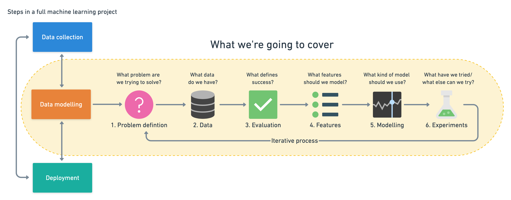
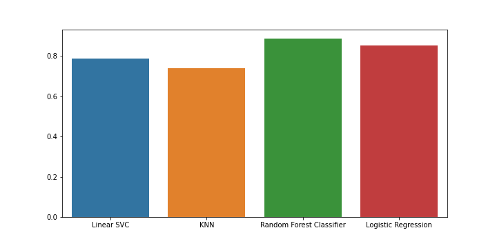
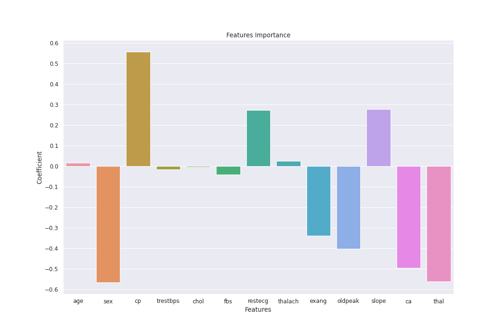

# Heart Disease Machine Learning Model
This project based in Python machine learning tools its created to build a machine learning model to predict whether or not a patient has heart disease base on ther clinical parameters.

I use the following framework to build this model from scratch

# 1. Problem Definition:
Can we predict whether or not a patient has heart disease based on their clinical parameters?

# 2. Data:
The dataset used in this project was downloaded from the following source of Kaggle.
https://www.kaggle.com/ronitf/heart-disease-uci

# 3. Evaluation:
the goal of this project its to get at least 90% accuracy to predict whether or not a patient has heart disease.

# 4. Features:
These are the clinical parameters of the patients:
- age
- sex
- cp: chest pain type (4 values)
  - 0: Typical angina: chest pain related decrease blood supply to the heart
  - 1: Atypical angina: chest pain not related to heart
  - 2: Non-anginal pain: typically esophageal spasms (non heart related)
  - 3: Asymptomatic: chest pain not showing signs of disease
- trestbps: tresting blood pressure (in mm Hg on admission to the hospital)
  - anything above 130-140 is typically cause for concern
- chol: serum cholestoral in mg/dl
  - serem = LDL + HDL + 0.2 triglycerides
- fbs: fasting blood sugar > 120 mg/dl (1 = true, 0 = false)
  - >126 mg/fL signals diabetes
- restecg: resting electrocardiographic results (values 0,1,2)
  - 0 = nothing to note
  - 1 = ST-T wave abnormality
  - 2 = possible or definite left ventricular hypertrophy
- thalach: maximum heart rate achieved
- exang: exercise induced angina (1 = yes, 0 = no)
- oldpeak = ST depression induced by exercise relative to rest
  - looks at stress of heart during excercise
  - unhealthy heart will stress more
- slope: the slope of the peak exercise ST segment
  - 0 = upsloping, better heart rate with excercise (uncommon)
  - 1 = flatsloping, minimal change (typical healthy heart)
  - 2 = downsloping, signs of unhealthy heart
- ca: number of major vessels (0-3) colored by flourosopy
- thal: thalium stress result 
  - 1-3 = normal
  - 6 = fixed defect
  - 7 = reversable defect
- target - have disease or not (1=yes, 0=no) (= the predicted attributes).

# Modeling:
For this project we chosse classification models, all that scikit-learn can give us.
Models that we tried:
- Logistic Regression
- RandomForestClassifier
- Linear SVC
- KNeighborsClassifier

# Experiment:
Trying all the models for classification and after tunning we choose `Logistic Regression` with somes specific hyperparameters because give us the best the best performance.

# Conlusion:
* Because this dataset its limited (about 300 samples), we could not reach our goal to obtain at least 90% accuracy, but we absolutly find out some interesting things about this reserach and trained a model to predict with 86% of accuracy if a patient has or no Heart Disease.
* The plots that we created could be use as a reference in future researches about this topic, maybe try a different model to improve the accuracy.

## Notes:
* Chest pain its the most importance variable to predict if a patient has heart disease or not, at least with this dataset and in the same environtment.
* The best estimiator is Logistic Regression tunned with the parameters defined with the GridSearchCV.
- All the plots created in this notebook are located in './images'

### Libraries:
- Pandas
- Numpy
- Matplotlib
- Seaborn
- Scikit-learn

